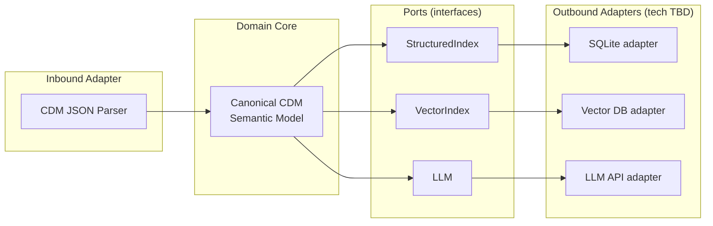

# ADR-0001: Hexagonal Architecture (Ports & Adapters)

**Status:** Accepted
**Date:** 2026-08-11
**Deciders:** Emre Gözütok

## Context

The system depends on three externally-swappable capabilities — a structured fact store, a vector store, and an LLM — plus one messy external data format (Microsoft CDM JSON). The case study brief explicitly grades "unit tests for retrieval logic," which is hard to guarantee against live external dependencies.

## Decision Drivers

- Must unit-test retrieval logic without live external services — an explicit grading criterion in the brief.
- Must be able to swap vector DB / LLM vendor later ([`FINDINGS.md §7`](../../FINDINGS.md#7-open-architecture-decisions)) without touching domain logic.
- Must keep the messiness of raw CDM JSON parsing isolated from everything downstream.

## Decision

Model the Canonical CDM Semantic Model (see [ADR-0007](0007-resolver-scope-bounded-anti-corruption-layer.md)) as the domain core. Define three ports — `StructuredIndex`, `VectorIndex`, `LLM` — with concrete technology as adapters behind them, selected in a later tech-decision pass (see [`FINDINGS.md §7`](../../FINDINGS.md#7-open-architecture-decisions)). The CDM parser is itself an adapter feeding the Resolver.

## Consequences

### Positive
- Retrieval logic is unit-testable against fakes/in-memory adapters — no live DB or API key needed to run the test suite.
- Vector DB or LLM can be swapped without touching domain logic.

### Negative
- One layer of indirection (port interfaces) that a pure script wouldn't need.
- Requires writing small interface definitions up front, before any adapter exists.

## Alternatives Considered

Direct coupling to a specific vector DB client throughout the codebase — rejected, makes retrieval logic untestable without a live service and couples the demo to one vendor's API shape.

## Related Decisions

- [ADR-0007](0007-resolver-scope-bounded-anti-corruption-layer.md) — defines the domain core this ADR's ports surround
- [ADR-0003](0003-dual-projection-retrieval-not-cqrs.md) — the two data-side ports (`StructuredIndex`, `VectorIndex`) this ADR introduces
