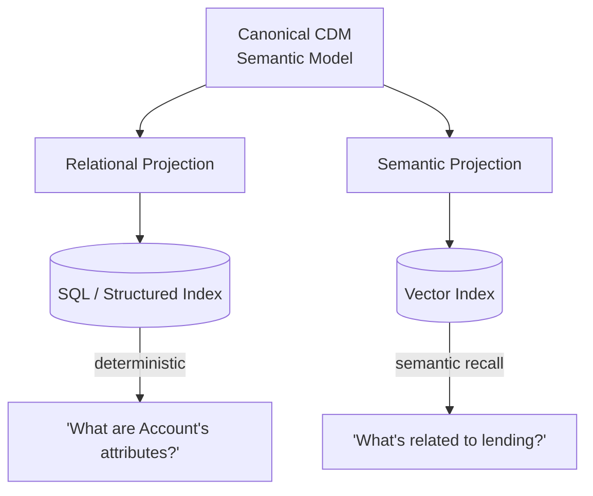

# ADR-0003: Dual-Projection Retrieval — "Polyglot Read Models," Not CQRS

**Status:** Accepted
**Date:** 2026-08-11
**Deciders:** Emre Gözütok

## Context

Two distinct question shapes exist: deterministic lookups ("what are Account's attributes") and open-ended/fuzzy ones ("what's related to lending"). Pure vector similarity is a poor fit for the former — it's the most likely source of a wrong-but-plausible answer.

## Decision

Project the Canonical CDM Semantic Model ([ADR-0007](0007-resolver-scope-bounded-anti-corruption-layer.md)) into two read-optimized indexes: a **relational projection** for exact entity/attribute/relationship lookups, and a **semantic projection** for vector search. Both are derived from the same canonical model at ingestion time — there is no write/command side, so this is **not** CQRS despite the superficial resemblance; it's simply two purpose-specific read models over one source of truth.

Framed positively: **SQL provides deterministic access to entities, attributes, and relationships; vector search provides semantic retrieval** — not "we use SQL because the dataset happens to be small" (see [ADR-0004](0004-embedded-structured-index-not-a-database-server.md) for the sizing argument, which concerns operational footprint, not whether a relational projection belongs in the architecture).

## Decision Drivers

- Deterministic questions (attribute/relationship lookups) need exact answers — vector similarity alone risks a plausible-but-wrong neighbor, the most graded-against failure mode.
- Open-ended/fuzzy questions still need semantic recall over free-text descriptions.
- The brief's own two example questions are both of the deterministic-lookup shape.

## Consequences

### Positive
- Deterministic questions get deterministic, cheap, testable answers; fuzzy questions still get semantic recall.
- The relational projection is a legible, demoable piece of classical data-engineering discipline, not just a RAG afterthought.

### Negative
- Two projections to keep in sync — mitigated, both are derived, read-only, rebuilt together from the same ingestion run ([ADR-0002](0002-separate-offline-ingestion-from-online-query-path.md)).

## Alternatives Considered

Vector-only retrieval — rejected, weakest guarantee against hallucination for exactly the question types the brief calls out as examples.

## Related Decisions

- [ADR-0004](0004-embedded-structured-index-not-a-database-server.md) — operational footprint of the relational projection
- [ADR-0009](0009-relationship-traversal-bounded-to-depth-2.md) — extends the relational projection with graph traversal
- [ADR-0016](0016-deterministic-hits-template-rendered.md) — how answers built from this projection are rendered
