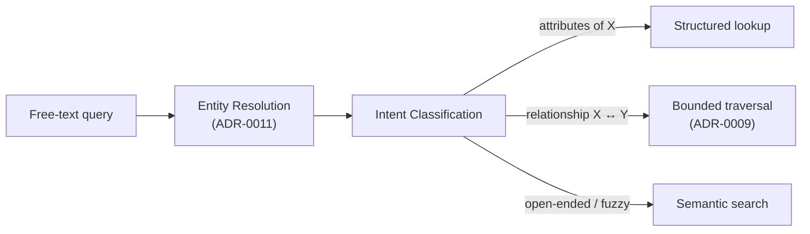

# ADR-0006: Intent Classification Is a Swappable Strategy; Only the LLM-Based Variant Is Exempt from Decision-Level Testing

**Status:** Accepted
**Date:** 2026-08-11
**Deciders:** Emre Gözütok

## Context

Query routing (structured vs. traversal vs. vector) can be done via a rule-based classifier or via LLM tool-use/function-calling. The rule-based version is a pure function — cheap and valuable to unit-test directly. The LLM-based version is non-deterministic, making its specific tool choice a poor thing to assert on in a test.

## Decision

Define routing behind a `Router`/Intent Classification port so either strategy can be swapped in, sitting downstream of Entity Resolution ([ADR-0011](0011-entity-name-matching-closed-vocabulary.md)) as a distinct stage.

- Rule-based router (the default): unit-tested directly like any pure function — e.g. "given this query text, assert the router selects the structured path."
- LLM-based router (if adopted later): tests target the retrieval functions it calls (`get_attributes`, `get_relationships`, `semantic_search`) directly, not the router's tool-selection decision.

Either way, the underlying retrieval functions are always unit-tested in isolation.

## Consequences

### Positive
- Full test coverage on the default (rule-based) router.
- Test suite stays deterministic and fast even if the router is swapped later.

### Negative
- If an LLM-based router ships, its selection quality needs scenario/eval-style testing rather than unit tests — a different, coarser guarantee.

## Alternatives Considered

Mandate rule-based routing only, never allow an LLM-based router — rejected, needlessly forecloses a legitimate future option; the testing boundary this ADR draws makes either choice safe.

## Related Decisions

- [ADR-0011](0011-entity-name-matching-closed-vocabulary.md) — the upstream Entity Resolution stage this router consumes
