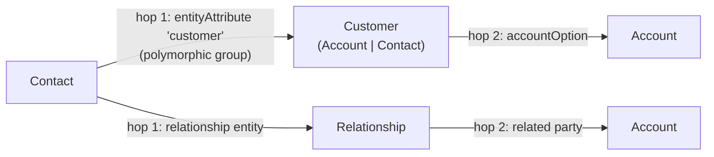

# ADR-0009: Relationship Traversal Is Graph-Shaped, Bounded to Depth 2

**Status:** Accepted
**Date:** 2026-08-11
**Deciders:** Emre Gözütok

## Context

[FINDINGS §5](../../FINDINGS.md#5-the-core-challenge-multi-hop-attribute--relationship-resolution) found that "how does Contact relate to Organization" — one of the brief's own example questions — has no direct `entityReference` between the two; the real answer runs through the polymorphic `Customer` group (Contact/Account as alternates) or the explicit `Relationship` entity. A single-hop `get_relationships(entity)` lookup would incorrectly report "no relationship found" for exactly this kind of question.

## Decision

`StructuredIndex` exposes a bounded traversal (breadth-first, depth ≤ 2) over relationship edges derived from `entityAttribute` references and the `Relationship` entity, in addition to single-hop `get_relationships`.

This is a deliberate **query-scope decision**, not a claim that the full CDM relationship graph has a maximum diameter of two — only 3 entities have been sampled so far. The cap is what the researched patterns needed; the evaluation set (see [`docs/quality/evaluation-strategy.md`](../quality/evaluation-strategy.md)) is what actually validates it's sufficient for the in-scope questions this system needs to answer.

Concrete example from the researched patterns — both real answers to "how does Contact relate to Account/Organization" resolve within exactly two hops:

## Consequences

### Positive
- The architecture can actually answer the brief's own example question, not just single-hop ones.

### Negative
- A genuine 3+-hop relationship, if one exists elsewhere in the ingested scope, would still be missed — documented as a known limit (see [Risks, `docs/architecture/principles.md`](../architecture/principles.md#risks--mitigations)), not silently handled.

## Alternatives Considered

Unbounded traversal — rejected, no evidence it's needed and it trades a predictable answer shape for open-ended graph walks that are harder to reason about and test.

## Implementation Notes

Breadth-first search from the query entity, depth ≤ 2, over an adjacency structure built once at ingestion time from all `entityAttribute` references plus the `Relationship` entity's records. At ~43 nodes this is trivially cheap (O(V+E), bounded further by the depth cap) — no graph database or specialized traversal library needed, a plain adjacency dict suffices.

## Related Decisions

- [ADR-0003](0003-dual-projection-retrieval-not-cqrs.md) — the relational projection this traversal operates over
- [ADR-0005](0005-explicit-grounding-guard-before-generation.md) — grounding treats any traversal hit as boolean-grounded
