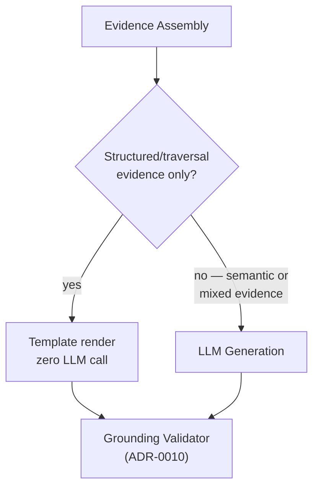

# ADR-0016: Deterministic Hits Are Template-Rendered; LLM Reserved for Answers That Need Synthesis

**Status:** Accepted (supersedes [ADR-0013](0013-deterministic-hits-through-llm-for-phrasing.md))
**Date:** 2026-08-11
**Deciders:** Emre Gözütok

## Context

[ADR-0013](0013-deterministic-hits-through-llm-for-phrasing.md) originally routed every answer — including fully-deterministic structured/traversal hits — through the LLM for consistency of voice. On reconsideration: a template rendered directly from verified structured facts has zero hallucination surface for that class of question, is faster and cheaper, and demonstrates a principle that matters specifically for a Data & AI Architect: **use the LLM where semantic interpretation adds value, not for operations a database can already answer deterministically.**

## Decision

- Structured-only or traversal-only evidence (no semantic/vector context involved) → **Deterministic Answer**: rendered by a template directly from the retrieved facts, no LLM call.
- Semantic evidence, or a mix of structured + semantic evidence requiring synthesis → **LLM Generation**, context-only, as before.

Both paths still pass through the Grounding Validator ([ADR-0010](0010-post-generation-grounding-verification.md)) — for templated answers this trivially passes, serving mainly as a regression check on the template logic rather than a meaningful runtime gate.

## Consequences

### Positive
- Zero hallucination risk on the most common question type (plain attribute/relationship lookups).
- Lower cost/latency.
- A clean, quotable architectural principle for the interview.

### Negative
- Two answer-construction code paths instead of one — template rendering needs its own (small) test coverage.
- Slightly less "consistent voice" between templated and generated answers — acceptable given the accuracy benefit.

## Alternatives Considered

[ADR-0013](0013-deterministic-hits-through-llm-for-phrasing.md)'s original always-LLM approach — superseded for the reasons above. Template-only with no LLM at all — rejected, the semantic/vector path still needs generation to synthesize free-text retrieved snippets into an answer.

## Implementation Notes

Plain Python f-string templates, one per intent shape (attribute list, single-hop relationship, depth-2 traversal path) — the number of distinct deterministic answer shapes is small and fixed, so a templating engine dependency (Jinja2 etc.) isn't warranted.

## Related Decisions

- [ADR-0013](0013-deterministic-hits-through-llm-for-phrasing.md) — superseded by this decision
- [ADR-0010](0010-post-generation-grounding-verification.md) — narrowed in scope by this decision
- [ADR-0003](0003-dual-projection-retrieval-not-cqrs.md) — the relational projection that feeds the deterministic path
