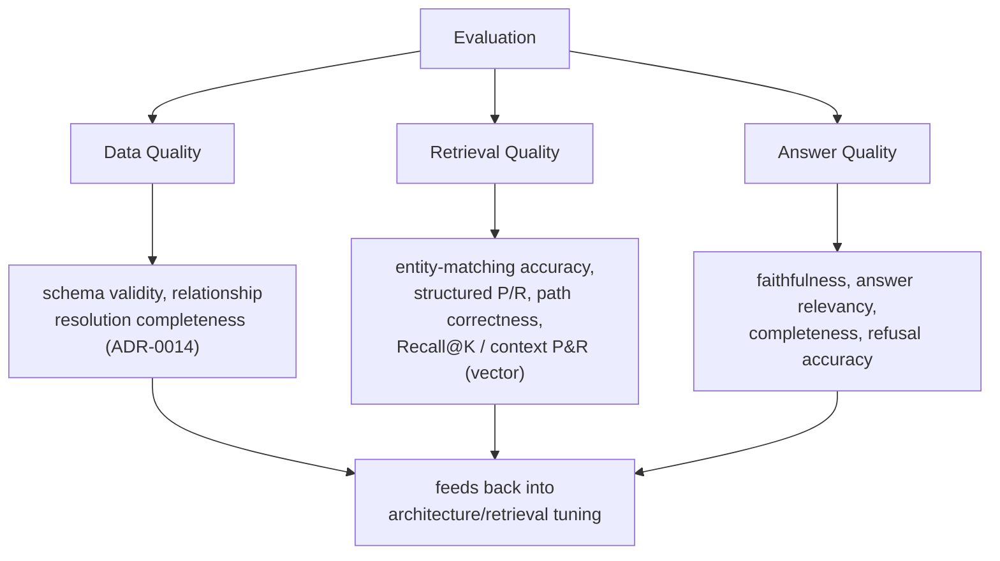

# ADR-0017: Evaluation Is a First-Class Architectural Layer, Not a Subset of Unit Testing

**Status:** Accepted
**Date:** 2026-08-11
**Deciders:** Emre Gözütok

## Context

Unit/integration tests ([ADR-0018](0018-testing-strategy-istqb-aligned.md)) verify that code behaves as coded — deterministic, pass/fail. They cannot verify whether a *retrieved-and-generated answer is actually good*: whether the right entity was matched, whether the right facts were retrieved, whether the answer is faithful to those facts, whether an out-of-scope question was correctly refused. That's an empirical property of the system's behavior against real questions, not a code-correctness property. ISTQB's Certified Tester AI Testing syllabus (CT-AI v2.0) draws this same line explicitly: it treats input-data testing, ML/AI-behavior testing, and system-level testing as distinct disciplines from conventional functional testing, each needing its own metrics and its own place in the lifecycle. Treating evaluation as "just another test suite" would bury exactly the property the case study brief grades — non-hallucinated, accurate answers — inside a pass/fail test runner it doesn't fit.

## Decision

Evaluation is a standalone layer spanning the whole pipeline, not a step inside ingestion or a category of unit test. It measures three things independently, matching the system's own layering ([`docs/architecture/components.md`](../architecture/components.md)):

```
                         Evaluation
                             │
          ┌──────────────────┼──────────────────┐
          ↓                  ↓                  ↓
    Data Quality        Retrieval Quality   Answer Quality
          │                  │                  │
   schema validity      entity matching      faithfulness /
   relationship          accuracy            supported-claim rate
   resolution           structured P/R       answer relevancy
   completeness         path correctness      completeness
   (ADR-0014 output)     Recall@K/context      refusal accuracy
                         precision/recall
                         (vector path)
```

- **Data Quality** is measured from the ingestion Validation Pass ([ADR-0014](0014-explicit-validation-pass.md)) output — entities resolved vs. discovered, unresolved-reference rate. Aligns with ISO/IEC 25059 AI-specific data-quality characteristics as referenced by ISTQB CT-AI v2.0.
- **Retrieval Quality** is measured per retrieval path: entity-matching accuracy ([ADR-0011](0011-entity-name-matching-closed-vocabulary.md)), structured-lookup precision/recall, graph-traversal path correctness ([ADR-0009](0009-relationship-traversal-bounded-to-depth-2.md)), and — for the vector path only — Recall@K plus RAGAS's Context Precision / Context Recall.
- **Answer Quality** is measured on the generated/rendered answer: RAGAS's Faithfulness (mapped operationally onto the Grounding Validator's supported-claim check, [ADR-0010](0010-post-generation-grounding-verification.md)), Answer Relevancy, a completeness check specific to attribute-listing answers, and refusal accuracy for out-of-scope questions.

Concrete metric definitions and the evaluation dataset spec live in [`docs/quality/evaluation-strategy.md`](../quality/evaluation-strategy.md).



## Consequences

### Positive
- "Non-hallucinating RAG" becomes an empirically checked property with named, industry-recognized metrics (RAGAS, ISTQB CT-AI-aligned data-quality characteristics), not a prompting hope.
- Each layer's failure is diagnosable independently — a bad answer can be traced to entity mismatch, retrieval miss, or generation embellishment instead of one opaque "wrong answer."
- Reuses named, recognizable frameworks (RAGAS, ISTQB CT-AI) rather than inventing bespoke metrics — stronger, more defensible positioning for the interview.

### Negative
- More moving pieces than a single pass/fail test suite; requires the evaluation dataset ([`docs/quality/evaluation-strategy.md`](../quality/evaluation-strategy.md)) to exist before most of these metrics are computable.
- RAGAS-style LLM-judged metrics (Faithfulness, Answer Relevancy) require LLM calls to score, so they're not free/instant like a unit test — informs the CI/CD gating decision ([ADR-0019](0019-cicd-pipeline-layered-by-cost-and-speed.md)).

## Alternatives Considered

Fold evaluation into the unit test suite as "integration tests with fuzzy assertions" — rejected, conflates two different disciplines (code correctness vs. empirical output quality) and would either weaken the unit test suite's determinism or under-measure answer quality.

## Implementation Notes

Dataset and runner live under `tests/eval/` (see [`docs/design/subsystem-design.md`](../design/subsystem-design.md#project-layout)), deliberately outside `tests/unit`–`tests/acceptance` to keep the pass/fail vs. empirical-report distinction visible in the directory structure itself. Invoked via `task eval:run` ([ADR-0020](0020-task-automation-modular-taskfiles.md)), on the CI/CD slow gate only ([ADR-0019](0019-cicd-pipeline-layered-by-cost-and-speed.md)).

## Related Decisions

- [ADR-0018](0018-testing-strategy-istqb-aligned.md) — the complementary, deterministic testing layer this ADR is explicitly distinguished from
- [ADR-0014](0014-explicit-validation-pass.md) — source of the Data Quality metrics
- [ADR-0010](0010-post-generation-grounding-verification.md) — the mechanism Faithfulness/supported-claim measurement is built on
- [ADR-0019](0019-cicd-pipeline-layered-by-cost-and-speed.md) — how/when the evaluation set actually runs
