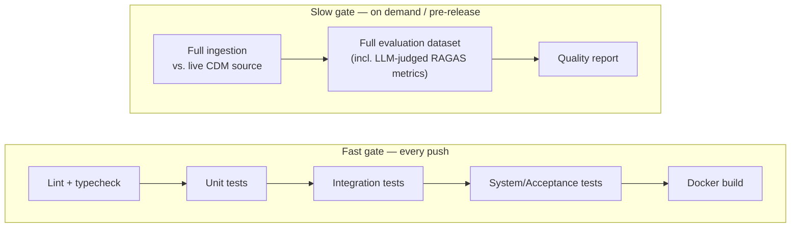

# ADR-0019: CI/CD Pipeline Layered by Cost and Speed

**Status:** Accepted
**Date:** 2026-08-11
**Deciders:** Emre Gözütok

## Context

The testing strategy ([ADR-0018](0018-testing-strategy-istqb-aligned.md)) and the evaluation layer ([ADR-0017](0017-evaluation-as-first-class-layer.md)) have very different cost profiles: Component/Unit and Component Integration tests are free and run in seconds against fakes/fixtures; System and Acceptance tests need the small ingested corpus but still no external paid services; the evaluation dataset's RAGAS-style metrics (Faithfulness, Answer Relevancy) require live LLM calls and cost real money and time per run. A single "run everything on every push" pipeline would either be slow/expensive on every commit, or would quietly skip evaluation and lose the property ADR-0017 exists to protect.

## Decision

Two gates, matched to cost:

**Fast gate — runs on every push:**
1. Lint + type check
2. Component/Unit tests (fakes only)
3. Component Integration tests (fixture `.cdm.json` files, no live source, no external services)
4. System/Acceptance tests (real small corpus, template-rendered deterministic paths only — no LLM calls)
5. Docker image build (build-only, not pushed)

**Slow gate — runs on demand / pre-release (manual trigger or scheduled, not on every push):**
1. Full ingestion against the live CDM source (network dependency, not just fixtures)
2. Full evaluation dataset run, including LLM-judged RAGAS metrics ([ADR-0017](0017-evaluation-as-first-class-layer.md)) — produces the quality report used to tune thresholds and as walkthrough-slide evidence

This mirrors the CI/CD literature's standard "fast feedback loop vs. slower confidence gate" split, applied here specifically because the slow gate's cost is dominated by LLM API calls rather than raw runtime.

## Consequences

### Positive
- Every push gets fast, free, deterministic feedback — no contributor is blocked waiting on or paying for LLM calls to open a PR.
- The evaluation report stays a real, run artifact (not skipped) because it has its own trigger and doesn't compete with the fast gate's speed budget.

### Negative
- The slow gate can drift out of sync with the code between pushes if not run before every release — mitigated by requiring it as an explicit pre-release step, not by full automation, given the case study's scope.
- Requires two pipeline configs/jobs instead of one — acceptable, small addition.

## Alternatives Considered

Run everything, including the evaluation dataset, on every push — rejected, imposes LLM cost and latency on every commit for a solo take-home project with no team to amortize that cost across.

Skip automated evaluation entirely, run it manually only — rejected, loses the "empirically checked, not just prompted" property that is the entire point of [ADR-0017](0017-evaluation-as-first-class-layer.md); making it a defined pipeline stage (even if manually triggered) keeps it a first-class, repeatable part of the system rather than an ad hoc one-off.

## Related Decisions

- [ADR-0017](0017-evaluation-as-first-class-layer.md) — the slow gate's primary content
- [ADR-0018](0018-testing-strategy-istqb-aligned.md) — the fast gate's primary content
- [ADR-0020](0020-task-automation-modular-taskfiles.md) — the task runner both gates invoke
