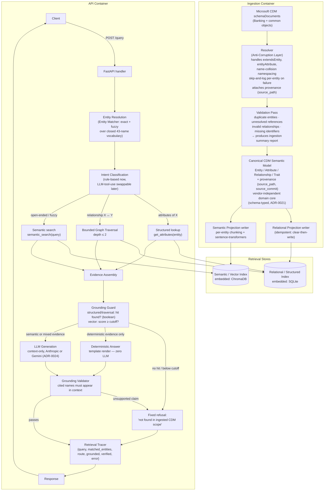

# Components

What's inside the Ingestion and API containers ([Containers](containers.md)). This is the full request/ingestion-time view; concrete adapter tech is chosen in [ADR-0023](../adr/0023-tech-layer-adapters.md) (ChromaDB, sentence-transformers, per-entity chunking) and [ADR-0024](../adr/0024-second-llm-provider-gemini.md) (Anthropic/Gemini, swappable via `LLM_PROVIDER`). The [Quality](../quality/README.md) and [Operations](../operations/README.md) layers that surround this diagram are documented separately.

Supporting read-only endpoints (`GET /entities`, `GET /entities/{name}`, `GET /health`) hit the Structured Index directly, bypassing the LLM entirely — useful both for the live demo and as a source of deterministic test fixtures. Endpoint contracts live in [API](../api/README.md).

## Component Catalog

| Component | Responsibility | Related ADR(s) |
|---|---|---|
| Resolver | Anti-corruption layer: turns raw CDM JSON into the Canonical Model | [0007](../adr/0007-resolver-scope-bounded-anti-corruption-layer.md), [0012](../adr/0012-ingestion-fails-per-entity-skip-and-log.md) |
| Validation Pass | Cross-entity integrity checks post-resolution | [0014](../adr/0014-explicit-validation-pass.md) |
| Canonical Model | Vendor-independent domain core (Entity/Attribute/Relationship/Trait + provenance) | [0007](../adr/0007-resolver-scope-bounded-anti-corruption-layer.md), [0015](../adr/0015-canonical-model-provenance.md), [0021](../adr/0021-schema-based-design-at-port-boundaries.md) |
| Relational/Semantic Projection writers | Populate the two read models from the Canonical Model | [0002](../adr/0002-separate-offline-ingestion-from-online-query-path.md), [0003](../adr/0003-dual-projection-retrieval-not-cqrs.md) |
| Entity Matcher (Entity Resolution) | Free-text → known entity name(s) | [0011](../adr/0011-entity-name-matching-closed-vocabulary.md) |
| Intent Classification (Router) | Query → retrieval path (structured / traversal / semantic) | [0006](../adr/0006-intent-classification-swappable-strategy.md) |
| Bounded Graph Traversal | Depth-≤2 relationship resolution | [0009](../adr/0009-relationship-traversal-bounded-to-depth-2.md) |
| Grounding Guard | Pre-generation check: is there anything to ground on? | [0005](../adr/0005-explicit-grounding-guard-before-generation.md) |
| Deterministic Answer (Template) | Zero-LLM rendering for fully-structured hits | [0016](../adr/0016-deterministic-hits-template-rendered.md) |
| LLM Generation | Context-only synthesis for semantic/mixed evidence | [0001](../adr/0001-hexagonal-architecture-ports-and-adapters.md) (port), [0016](../adr/0016-deterministic-hits-template-rendered.md), [0023](../adr/0023-tech-layer-adapters.md)/[0024](../adr/0024-second-llm-provider-gemini.md) (adapters) |
| Grounding Validator | Post-generation citation check | [0010](../adr/0010-post-generation-grounding-verification.md) |
| Retrieval Tracer | Structured log per query, for demo/debug evidence | See [Operations: Monitoring](../operations/monitoring.md) |

Dynamic (step-by-step) views of the ingestion and query flows are in [Design: Workflows](../design/workflows.md).
