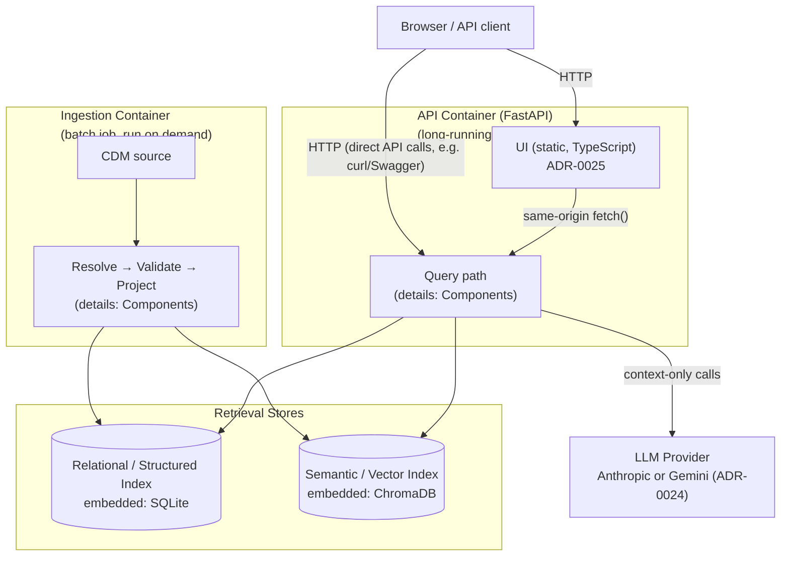

# Containers

The deployable units and how data flows between them. Two flows, deliberately separated ([ADR-0002](../adr/0002-separate-offline-ingestion-from-online-query-path.md)): an **offline ingestion pipeline** (run once/on demand, not on the request path) and an **online query path** (FastAPI request/response).

Both containers ship in the **same Docker image** ([ADR-0004](../adr/0004-embedded-structured-index-not-a-database-server.md) keeps the structured index embedded, not a separate service) — ingestion is invoked as `task ingest:run` before the API starts, not as a second always-on process. The UI is a third build stage ([ADR-0025](../adr/0025-ui-typescript-chat-and-entity-browser.md)) whose only runtime footprint is static files served by the same FastAPI process — no separate frontend server, no CORS. See [Operations: Deployment](../operations/deployment.md).

## Container responsibilities

| Container | Responsibility | Related ADRs |
|---|---|---|
| Ingestion pipeline | Parse CDM, resolve into the Canonical Model, validate, write both projections | [0002](../adr/0002-separate-offline-ingestion-from-online-query-path.md), [0007](../adr/0007-resolver-scope-bounded-anti-corruption-layer.md), [0014](../adr/0014-explicit-validation-pass.md) |
| Structured Index | Deterministic entity/attribute/relationship facts | [0003](../adr/0003-dual-projection-retrieval-not-cqrs.md), [0004](../adr/0004-embedded-structured-index-not-a-database-server.md), [0009](../adr/0009-relationship-traversal-bounded-to-depth-2.md) |
| Vector Index | Semantic recall over free-text entity descriptions | [0003](../adr/0003-dual-projection-retrieval-not-cqrs.md) |
| API service | Query handling, grounding, response | see [Components](components.md) for internals |
| UI (static) | Thin client — chat box + entity browser, no backend logic of its own | [0025](../adr/0025-ui-typescript-chat-and-entity-browser.md), supersedes [0022](../adr/0022-ui-layer-deferred-future-scope.md) |

Full internal detail (Entity Matcher, Intent Classification, Grounding Guard/Validator, etc.) is in [Components](components.md) — this page stops at the container boundary deliberately, per the C4 zoom levels this documentation layer follows.
