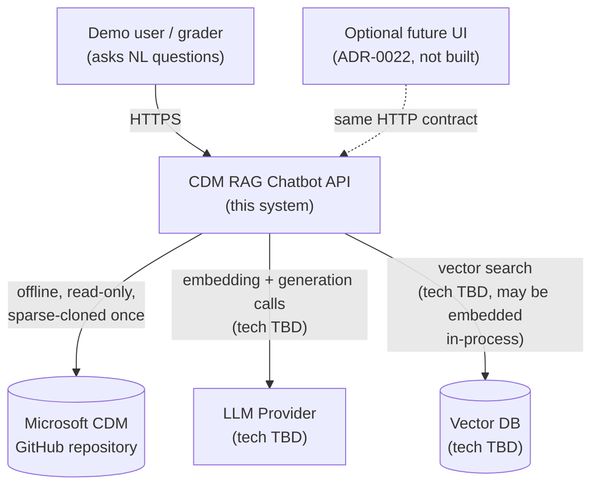

# System Context

The system as a black box: who uses it, and what it depends on outside itself.

## External dependencies

| Dependency | Nature | Notes |
|---|---|---|
| Microsoft CDM GitHub repository | Offline, read-only data source | Sparse-cloned once at ingestion time; not a runtime dependency of the query path. See [Domain](../domain/domain-model.md). |
| LLM Provider | Runtime, paid, on the semantic-synthesis path only | Vendor TBD — [`FINDINGS.md §7`](../../FINDINGS.md#7-open-architecture-decisions). Never called for fully-deterministic answers ([ADR-0016](../adr/0016-deterministic-hits-template-rendered.md)). |
| Vector DB | Runtime, on the semantic-search path only | Vendor TBD, likely embedded/in-process given corpus size — [`FINDINGS.md §7`](../../FINDINGS.md#7-open-architecture-decisions). |

## Who uses it

- A **demo user** (grader or the candidate) asking natural-language questions live, per [Vision: Goals](../vision/goals.md#who-its-for).
- A **future, optional UI** ([ADR-0022](../adr/0022-ui-layer-deferred-future-scope.md)) would sit in front of the same API contract — no privileged access, no bypass of grounding.

No authentication/authorization boundary is drawn here — none exists by design, see [Principles](principles.md#whats-deliberately-not-built-and-why).
