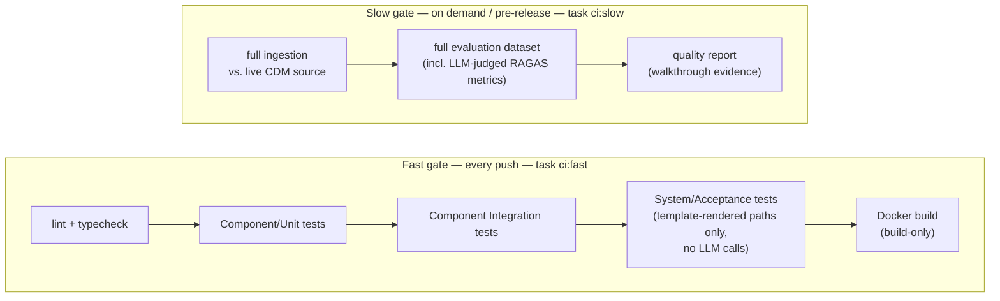

# CI/CD

Two gates, matched to cost ([ADR-0019](../adr/0019-cicd-pipeline-layered-by-cost-and-speed.md)) — [Testing](../quality/testing-strategy.md) is free and deterministic; [Evaluation](../quality/evaluation-strategy.md) needs LLM calls to score RAGAS-style metrics and costs real money/time per run.

Both gates are single commands — `task ci:fast` and `task ci:slow` ([Operations: Task Automation](task-automation.md)) — so CI config is a thin wrapper around exactly what a developer can run locally, with no separate CI-only script to drift out of sync.

No contributor is blocked waiting on or paying for LLM calls to open a PR; the evaluation report stays a real, run artifact (not silently skipped) because it has its own trigger and doesn't compete with the fast gate's speed budget.

**Known trade-off**: the slow gate can drift out of sync with the code between manual runs if not run before every release — accepted as a known limitation for a solo take-home rather than building full automation around it (see the corresponding row in [Architecture: Principles](../architecture/principles.md#risks--mitigations)).
